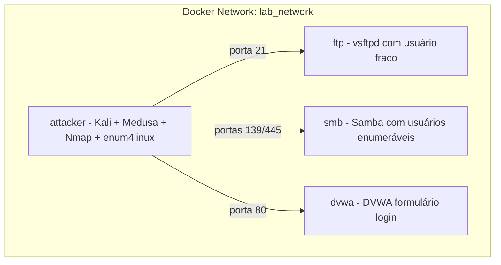

# Plano: Implementação do Lab Brute Force em Docker

## Contexto

O desafio original exige: (1) ambiente com Kali e Metasploitable 2, (2) brute force em FTP, (3) automação em formulário web (DVWA), (4) password spraying em SMB com enumeração de usuários, (5) documentação completa. A versão adaptada usa Docker em vez de VMs.

## Arquitetura Proposta



---

## Fase 1: Estrutura Base e Docker Compose

### 1.1 Criar `docker-compose.yml`

- **Rede:** `lab_network` (bridge) para comunicação entre containers
- **Serviços:**
  - `attacker`: build local a partir de `attacker/Dockerfile`, `stdin_open: true`, `tty: true` para `docker exec -it`
  - `ftp`: imagem customizada ou adaptada com vsftpd
  - `smb`: Samba com usuários fracos (estilo Metasploitable)
  - `dvwa`: imagem `vulnerables/web-dvwa` ou equivalente
- **Ordem:** `depends_on` para garantir que alvos subam antes do atacante (opcional, para healthchecks futuros)

### 1.2 Mapeamento de Portas (host)

- FTP: `2121:21` (evitar conflito com FTP local)
- SMB: `4455:445` e `1399:139` (evitar conflito com SMB local)
- DVWA: `4280:80`

---

## Fase 2: Container Atacante

### 2.1 `attacker/Dockerfile`

- Base: `kalilinux/kali-rolling`
- Pacotes: `medusa`, `nmap`, `enum4linux`, `smbclient`, `curl` (para validar HTTP)
- Manter container em execução com `sleep infinity` ou `tail -f /dev/null` para permitir `docker exec`

### 2.2 Montagem de Volumes

- `./wordlists:/wordlists` — pasta com `users.txt` e `passwords.txt`
- Facilita troca de wordlists sem rebuild

---

## Fase 3: Containers Alvo

### 3.1 FTP — `targets/ftp/`

- **Opção A (recomendada):** Dockerfile customizado
  - Base: `ubuntu` ou `debian` slim
  - Instalar `vsftpd`
  - Criar usuário `msfadmin` com senha `msfadmin` (e talvez `ftp:ftp`, `admin:admin`)
  - Configurar `vsftpd.conf` para permitir login local
- **Opção B:** Reaproveitar `vitalyford/vsftpd-2.3.4-vulnerable` se suportar credenciais — priorizar Opção A por controle total.

### 3.2 SMB — `targets/smb/`

- **Opção A:** Usar Vulhub `samba/CVE-2017-7494` e adaptar `smb.conf` para incluir shares com usuários conhecidos (`msfadmin`, `guest`, etc.) e senhas fracas.
- **Opção B:** Dockerfile com Samba e `smbpasswd` para criar usuários `msfadmin`, `root`, etc. com senhas fracas.
- Garantir enumeração com `enum4linux` e password spraying com Medusa (`-M smbnt`).

### 3.3 DVWA — `targets/dvwa/`

- Usar imagem pronta: `vulnerables/web-dvwa` ou `citizenstig/dvwa`
- Configurar nível de segurança **Low** (via interface ou variável, se disponível)
- Credenciais padrão: `admin` / `password` — a wordlist deve incluí-las para validação
- Medusa usa módulo `http-form` ou `web-form` com:
  - URL: `http://dvwa/login.php` (ajustar conforme imagem)
  - Método POST
  - Parâmetros: `username` e `password`
  - String de falha: `Login failed` ou equivalente

---

## Fase 4: Wordlists

### 4.1 `wordlists/users.txt`

```
msfadmin
admin
root
ftp
user
guest
```

### 4.2 `wordlists/passwords.txt`

```
msfadmin
password
123456
admin
root
ftp
letmein
```

- Tamanho pequeno para execução rápida; o desafio pede "wordlists simples".
- Documentar em README que wordlists maiores (`rockyou.txt`, etc.) podem ser usadas para testes adicionais.

---

## Fase 5: Scripts e Comandos

### 5.1 `scripts/run-attacks.sh` (opcional)

Script que executa, via `docker exec`, os ataques em sequência:

1. Nmap na rede (ex.: `nmap -sn 172.x.0.0/24` para descobrir hosts)
2. Nmap nos alvos (portas FTP, SMB, HTTP)
3. Medusa FTP contra `ftp:21`
4. Enum4linux contra `smb` para listar usuários
5. Medusa SMB (password spraying) com `users.txt` e `passwords.txt`
6. Medusa web-form contra DVWA

- Registrar saída em `logs/` (se desejado) ou orientar o usuário a copiar saída manualmente.

### 5.2 Documentar comandos manuais no README

Exemplo de comandos para copiar e colar:

```bash
# Reconhecimento
docker exec attacker nmap -sV -p 21,80,139,445 ftp smb dvwa

# FTP brute force
docker exec attacker medusa -h ftp -M ftp -u msfadmin -P /wordlists/passwords.txt

# SMB enumeração
docker exec attacker enum4linux -U smb

# SMB password spraying
docker exec attacker medusa -h smb -M smbnt -U /wordlists/users.txt -P /wordlists/passwords.txt

# DVWA (ajustar URL e parâmetros conforme módulo Medusa)
docker exec attacker medusa -h dvwa -M http-form ...
```

---

## Fase 6: Validação de Acessos

### 6.1 FTP

- Após Medusa, testar com `docker exec attacker ftp ftp` ou `curl ftp://ftp`.
- Documentar credencial obtida (ex.: `msfadmin:msfadmin`).

### 6.2 SMB

- `smbclient -L //smb/ -U msfadmin%msfadmin`
- Documentar shares e usuários válidos.

### 6.3 DVWA

- Após login, confirmar acesso à interface (Brute Force, etc.).
- Documentar credencial (`admin:password`).

---

## Fase 7: Documentação no README

### 7.1 Atualizar seção "Execução e Evidências"

- Comandos executados (copiar do script ou exemplos acima)
- Wordlists utilizadas
- Resultados do Medusa (credenciais encontradas)
- Screenshots ou logs em `docs/images/`

### 7.2 Atualizar seção "Mitigação e Boas Práticas"

- FTP: desabilitar usuários locais, usar SFTP/SCP, política de senha forte
- SMB: desabilitar SMBv1, restringir anônimo, bloqueio após N tentativas
- DVWA/web: rate limiting, CAPTCHA, lockout, 2FA
- Monitoramento: fail2ban, logs de autenticação, IDS

### 7.3 Atualizar "Estrutura do Repositório"

Incluir todos os arquivos criados conforme estrutura definida no plano.

### 7.4 Tabela de Requisitos

Marcar como concluídos na seção "Minha versão do desafio" após execução bem-sucedida.

---

## Fase 8: Arquivos Auxiliares

### 8.1 `.gitignore`

- `logs/`
- Arquivos temporários ou sensíveis

### 8.2 `Makefile` ou `README` com quick start

- `make up` / `make start`: `docker compose up -d`
- `make attack`: `docker exec -it attacker bash` (ou execução do script)
- `make down`: `docker compose down`

---

## Ordem de Implementação Sugerida

| Ordem | Item | Dependências |
|-------|------|--------------|
| 1 | **docs/plano-implementacao.md** — Documentar o plano completo | — |
| 2 | Wordlists | — |
| 3 | Dockerfile do atacante | — |
| 4 | Dockerfile do FTP | — |
| 5 | Dockerfile/config do SMB | — |
| 6 | docker-compose.yml (incluir DVWA) | 3, 4, 5 |
| 7 | Execução manual e validação | 6 |
| 8 | Script run-attacks.sh | 7 |
| 9 | Documentação README (evidências + mitigação) | 7 |
| 10 | Screenshots em docs/images | 9 |

---

## Riscos e Mitigações

| Risco | Mitigação |
|-------|-----------|
| Porta 445 em uso no host | Usar porta alternativa (ex.: 4455) no mapeamento |
| Medusa web-form com sintaxe diferente | Consultar `medusa -M http-form -q` e documentar parâmetros exatos do DVWA |
| DVWA exige setup (Create Database) | Usar imagem que já venha configurada ou documentar passo a passo |
| Kali imagem grande | Considerar `kalilinux/kali-rolling` mínimo e instalar só os pacotes necessários |

---

## Referências Técnicas

- [Medusa modules](https://www.kali.org/tools/medusa/) — `ftp`, `smbnt`, `http-form` / `web-form`
- [Enum4linux](https://www.kali.org/tools/enum4linux/) — enumeração SMB
- [Vulhub Samba CVE-2017-7494](https://github.com/vulhub/vulhub/tree/master/samba/CVE-2017-7494)
- [DVWA Brute Force](https://github.com/digininja/DVWA) — parâmetros do formulário de login
